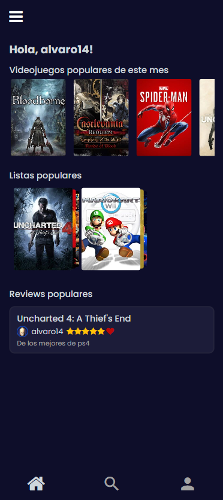
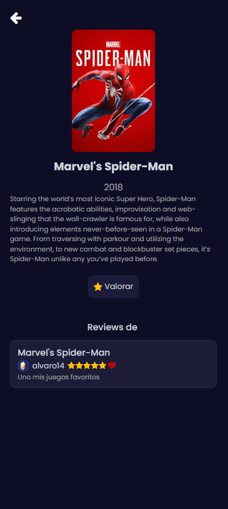
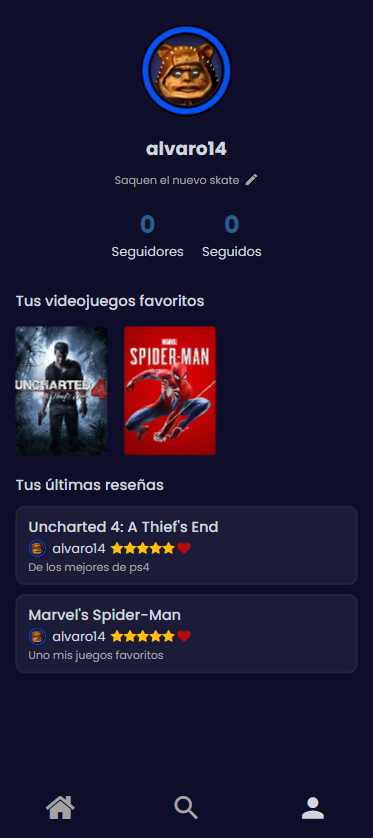

# 🎮 GameVerse
 
Aplicación móvil para descubrir videojuegos, escribir reseñas y organizarlos en listas personalizadas. Desarrollada con **React Native**, **Expo** y **TypeScript**.
 

<p align="center">
  
  
  
</p>
 
## ✨ Funcionalidades
 
- **Registro e inicio de sesión** de usuarios.
- **Pantalla principal** para explorar videojuegos.
- **Búsqueda** de videojuegos.
- **Ficha de cada juego** con su descripción y detalles.
- **Reseñas**: valora y comenta los juegos.
- **Listas personalizadas** para organizar tus videojuegos.
- **Perfil de usuario**.
## 🛠️ Tecnologías
 
| Área | Tecnología |
| --- | --- |
| Framework | React Native 0.76 + Expo 52 |
| Lenguaje | TypeScript |
| Navegación | React Navigation (native-stack, stack, bottom-tabs, drawer) |
| Peticiones HTTP | Axios |
| Animaciones y gestos | Reanimated, Gesture Handler |
| UI | react-native-modal, carruseles (reanimated-carousel, snap-carousel), switch-selector |
| Seguridad | crypto-js |
| Tipografías | Roboto y Poppins |
 
## 📁 Estructura del proyecto
 
```
GameVerse_React/
├── app/
│   ├── domain/
│   │   └── entities/          # Entidades (Videojuego, Usuario...)
│   └── presentation/
│       ├── theme/             # Colores y estilos globales
│       └── views/
│           ├── auth/          # Pantallas: Login, Register, Home, Search,
│           │                  # Description, Review, List, Games, Profile...
│           └── client/
│               └── context/   # AuthContext y UserContext
├── assets/                    # Fuentes e imágenes
├── App.tsx                    # Navegación principal y proveedores de contexto
├── index.ts                   # Punto de entrada
└── app.json                   # Configuración de Expo
```
 
## 🚀 Puesta en marcha
 
### Requisitos
 
- [Node.js](https://nodejs.org/) (LTS)
- npm
- La app **Expo Go** en tu móvil, o un emulador de Android / iOS
### Instalación
 
```bash
# 1. Clona el repositorio
git clone https://github.com/alvarofuentes13/GameVerse_React.git
cd GameVerse_React
 
# 2. Instala las dependencias
npm install
 
# 3. Arranca el proyecto
npm start
```
 
Escanea el código QR con Expo Go, o usa uno de estos atajos:
 
```bash
npm run android   # Emulador Android
npm run ios       # Simulador iOS (macOS)
npm run web       # Navegador
```
 
## ⚙️ Backend (API)
 
La aplicación consume una API REST desarrollada con **Spring Boot + MySQL**, disponible en el repositorio [GameVerse_SpringBoot](https://github.com/alvarofuentes13/GameVerse_SpringBoot). Para que la app funcione, la API tiene que estar en marcha.
 
### Requisitos del backend
 
- [JDK 21](https://adoptium.net/)
- [Docker](https://www.docker.com/) y Docker Compose
### Cómo arrancarla
 
```bash
# 1. Clona el repositorio del backend
git clone https://github.com/alvarofuentes13/GameVerse_SpringBoot.git
cd GameVerse_SpringBoot
 
# 2. Levanta MySQL (puerto 3306) y phpMyAdmin (http://localhost:8081)
docker compose up -d
 
# 3. Arranca la API
./mvnw spring-boot:run        # En Windows: mvnw.cmd spring-boot:run
```
 
Por defecto la API queda disponible en `http://localhost:8080`.
 
### Conectar la app con la API
 
Configura la URL base de la API en el código de la app ([@ApiDelivery.tsx](https://github.com/alvarofuentes13/GameVerse_React/blob/master/app/data/sources/remote/api/ApiDelivery.tsx)). La URL depende de dónde ejecutes la app:
 
| Entorno | URL |
| --- | --- |
| Emulador Android | `http://10.0.2.2:8080` |
| Simulador iOS / Web | `http://localhost:8080` |
| Móvil físico (Expo Go) | `http://<IP-local-de-tu-PC>:8080` |
 
> 💡 Con un móvil físico, el teléfono y el ordenador deben estar en la misma red Wi-Fi.
 
 
## 👤 Autores

**Álvaro Fuentes** — [@alvarofuentes13](https://github.com/alvarofuentes13) <br>
**Óscar Arboleya** — [@oscararbo](https://github.com/oscararbo)